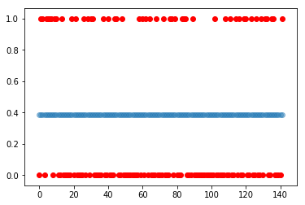

- There is no wiki page as the same wiki content has been included in jupyter notebook (scroll below)
- [My Jupyter Notebook](https://github.com/Ruthvicp/CS5590_PyDL/blob/master/Module2/In_Class_Exercise/ICE1/Source/First_Neural_Network.ipynb)
- [Youtube demo](https://youtu.be/CVqNUAQXlOw)
- Also the source code can be found in the form of .py file [here](https://github.com/Ruthvicp/CS5590_PyDL/tree/master/Module2/In_Class_Exercise/ICE1/Source/DeepLearning_Lesson1)
- Datasets : [Here](https://github.com/Ruthvicp/CS5590_PyDL/tree/master/Module2/In_Class_Exercise/ICE1/Source/DeepLearning_Lesson1)

### Jupyter notebook preview


## Ruthvic Punyamurtula
### Created : March 15, 2019
### This is the first in class exercise for Deep Learning class and in this we built first Neural Network in Keras. The first program evaluates diabetes dataset. This is to understand how a neural network is created and how the layers are added to the model. We also find how a model performance can be improved by adding a Dense layer to the network


```python
import pandas
from keras.models import Sequential
from keras.layers.core import Dense, Activation
from sklearn.model_selection import train_test_split
import pandas as pd
import numpy as np
```

    C:\Users\ruthv\Anaconda3\lib\site-packages\h5py\__init__.py:36: FutureWarning: Conversion of the second argument of issubdtype from `float` to `np.floating` is deprecated. In future, it will be treated as `np.float64 == np.dtype(float).type`.
      from ._conv import register_converters as _register_converters
    Using TensorFlow backend.
    


```python
dataset = pd.read_csv("diabetes.csv", header=None).values
print(dataset.shape)
```

    (768, 9)
    

### The data set contains 9 columns. Let us take 0 to 8 columns as X and 9th column as Y. And also consider 75% of the data for trianing and 25% for testing. We perform the same with the below operation.


```python
X_train, X_test, Y_train, Y_test = train_test_split(dataset[:,0:8], dataset[:,8],
                                                    test_size=0.25, random_state=87)

```

Now we create a sequential model and add layers to it. 


```python
np.random.seed(155)
my_first_nn = Sequential() # create model
my_first_nn.add(Dense(20, input_dim=8, activation='relu')) # hidden layer
my_first_nn.add(Dense(1, activation='sigmoid')) # output layer
my_first_nn.compile(loss='binary_crossentropy', optimizer='adam')
my_first_nn_fitted = my_first_nn.fit(X_train, Y_train, epochs=100, verbose=0,
                                     initial_epoch=0)
```


```python
print(my_first_nn.summary())
print(my_first_nn.evaluate(X_test, Y_test, verbose=0))
```

    _________________________________________________________________
    Layer (type)                 Output Shape              Param #   
    =================================================================
    dense_4 (Dense)              (None, 20)                180       
    _________________________________________________________________
    dense_5 (Dense)              (None, 1)                 21        
    =================================================================
    Total params: 201
    Trainable params: 201
    Non-trainable params: 0
    _________________________________________________________________
    None
    0.6925122936566671
    

### Now lets add another dense layer to the previous model and evaluate the model again


```python
my_first_nn = Sequential() # create model
my_first_nn.add(Dense(20, input_dim=8, activation='relu')) # hidden layer
my_first_nn.add(Dense(4, input_dim=2, activation='relu'))
my_first_nn.add(Dense(1, activation='sigmoid')) # output layer
my_first_nn.compile(loss='binary_crossentropy', optimizer='adam')
my_first_nn_fitted = my_first_nn.fit(X_train, Y_train, epochs=100, verbose=0,
                                     initial_epoch=0)
```


```python
print(my_first_nn.summary())
print(my_first_nn.evaluate(X_test, Y_test, verbose=0))
```

    _________________________________________________________________
    Layer (type)                 Output Shape              Param #   
    =================================================================
    dense_24 (Dense)             (None, 20)                180       
    _________________________________________________________________
    dense_25 (Dense)             (None, 4)                 84        
    _________________________________________________________________
    dense_26 (Dense)             (None, 1)                 5         
    =================================================================
    Total params: 269
    Trainable params: 269
    Non-trainable params: 0
    _________________________________________________________________
    None
    0.738659679889679
    

### The second program is create a neural network for the breast cancer dataset. We predict if the cancer is Malignant or Benign


```python
from sklearn.metrics import average_precision_score
from sklearn import preprocessing
from matplotlib import pyplot as plt
```


```python
dataset = pd.read_csv("Breas Cancer.csv")
print(dataset.shape)
print(dataset.head(5))
```

    (569, 33)
             id diagnosis  radius_mean  texture_mean  perimeter_mean  area_mean  \
    0    842302         M        17.99         10.38          122.80     1001.0   
    1    842517         M        20.57         17.77          132.90     1326.0   
    2  84300903         M        19.69         21.25          130.00     1203.0   
    3  84348301         M        11.42         20.38           77.58      386.1   
    4  84358402         M        20.29         14.34          135.10     1297.0   
    
       smoothness_mean  compactness_mean  concavity_mean  concave points_mean  \
    0          0.11840           0.27760          0.3001              0.14710   
    1          0.08474           0.07864          0.0869              0.07017   
    2          0.10960           0.15990          0.1974              0.12790   
    3          0.14250           0.28390          0.2414              0.10520   
    4          0.10030           0.13280          0.1980              0.10430   
    
          ...       texture_worst  perimeter_worst  area_worst  smoothness_worst  \
    0     ...               17.33           184.60      2019.0            0.1622   
    1     ...               23.41           158.80      1956.0            0.1238   
    2     ...               25.53           152.50      1709.0            0.1444   
    3     ...               26.50            98.87       567.7            0.2098   
    4     ...               16.67           152.20      1575.0            0.1374   
    
       compactness_worst  concavity_worst  concave points_worst  symmetry_worst  \
    0             0.6656           0.7119                0.2654          0.4601   
    1             0.1866           0.2416                0.1860          0.2750   
    2             0.4245           0.4504                0.2430          0.3613   
    3             0.8663           0.6869                0.2575          0.6638   
    4             0.2050           0.4000                0.1625          0.2364   
    
       fractal_dimension_worst  Unnamed: 32  
    0                  0.11890          NaN  
    1                  0.08902          NaN  
    2                  0.08758          NaN  
    3                  0.17300          NaN  
    4                  0.07678          NaN  
    
    [5 rows x 33 columns]
    

### We take 2nd column as Y, omit the forst column and consider the rest of the columns 3 to 33 as X.


```python
label_encoder = preprocessing.LabelEncoder()
y = label_encoder.fit_transform(dataset.iloc[1:,1].values)
X_train, X_test, Y_train, Y_test = train_test_split(dataset.iloc[1:,2:32].values, y,
                                                    test_size=0.25, random_state=87)
```


```python
np.random.seed(155)
my_first_nn = Sequential() # create model
my_first_nn.add(Dense(16, input_dim=30, activation='relu')) # hidden layer
my_first_nn.add(Dense(4, input_dim=4, activation='relu'))
my_first_nn.add(Dense(1, activation='sigmoid')) # output layer
my_first_nn.compile(loss='binary_crossentropy', optimizer='adam')
my_first_nn_fitted = my_first_nn.fit(X_train, Y_train, epochs=100, verbose=0, initial_epoch=0)
```


```python
print(my_first_nn.summary())
scores = my_first_nn.evaluate(X_test, Y_test, verbose=0)
Y_pred = my_first_nn.predict(X_test)
```

    _________________________________________________________________
    Layer (type)                 Output Shape              Param #   
    =================================================================
    dense_27 (Dense)             (None, 16)                496       
    _________________________________________________________________
    dense_28 (Dense)             (None, 4)                 68        
    _________________________________________________________________
    dense_29 (Dense)             (None, 1)                 5         
    =================================================================
    Total params: 569
    Trainable params: 569
    Non-trainable params: 0
    _________________________________________________________________
    None
    


```python
average_precision = average_precision_score(Y_test,Y_pred)
print(average_precision)
print(scores)
```

    0.3380281690140845
    0.6451189299704323
    

### Now lets plot Y_test (in red) and Y_pred (in blue) with no. of samples (indices) as X axis. 


```python
n = X_test.shape[0]
print(n)
print(Y_pred.shape)
```

    142
    (142, 1)
    


```python

t = np.arange(0, n, step=1)
plt.scatter(t,Y_test, color='r')
plt.scatter(t,Y_pred, alpha=0.45)
plt.show()
```





### This is actually a very bad prediction, but the intuition here is to understand how a neural networks feeds the data and how layers are added in keras. How to add the activation function and plotting the results.

### Remarks :
- You can use this notebook to understand basic keras model
- Experiment with different values for dense layer parameters
- Try modifying the input dimensions of hidden layers
- Note that the dataset dimensions and input layer (first layer) should have same dimensions
- Try to improve the accuracy of the Breast cancer model
